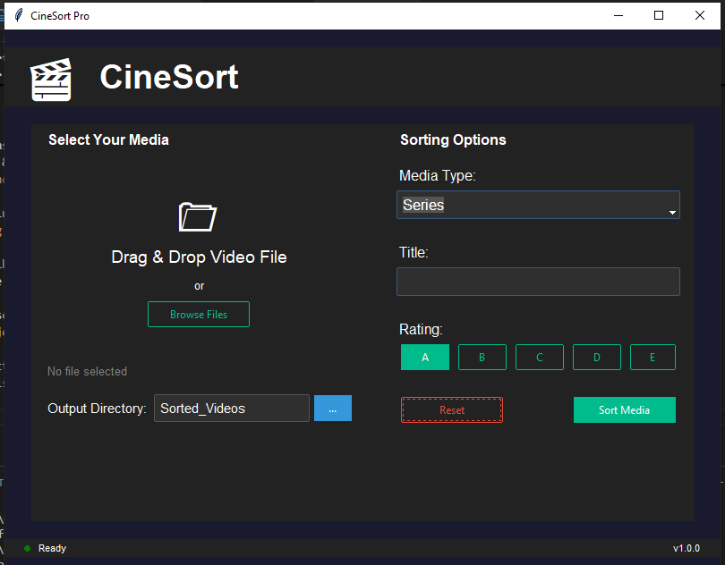

# CineSort Pro

## Overview
CineSort Pro is a modern media sorting application designed to help users organize their movie and TV series collections efficiently. With an intuitive drag-and-drop interface, rating system, and automatic folder organization, it simplifies media management.

## Features
- **Drag & Drop Interface:** Easily add media files by dragging them into the app.
- **Automated Sorting:** Organizes files based on category, name, and rating.
- **Custom Output Directory:** Choose where to store your sorted media.
- **Theming & Animations:** A sleek UI with modern dark mode and subtle animations.
- **Batch Processing:** Supports handling multiple files at once.

## Technologies Used
- **Python** (Backend Logic)
- **Tkinter & TkinterDnD2** (GUI & Drag-and-Drop functionality)
- **TTK Bootstrap** (Modern UI Styling)
- **Pillow** (Image Processing)
- **Shutil & OS** (File Management)
- **Threading** (Smooth UI Performance)

## Installation
### Prerequisites
Ensure you have Python 3 installed. Install dependencies with:
```sh
pip install tkinterdnd2 ttkbootstrap pillow
```

### Running the Application
Clone the repository and run the script:
```sh
git clone https://github.com/Deepanshu0211/CineSortPro.git
cd CineSortPro
python main.py
```

## Usage
1. **Add Files**: Drag and drop media files into the application or use the "Browse" button.
2. **Set Details**: Choose category (Movie/Series), enter a title, and set a rating.
3. **Sort Media**: Click "Sort Media" to move files to organized folders.
4. **View Results**: Your files will be placed in `Sorted_Videos/[Category]/[Title]/[Rating]/`.

## Folder Structure
```
Sorted_Videos/
├── Movie/
│   ├── Interstellar/
│   │   ├── A/
│   │   │   ├── Interstellar.mp4
│   │   │   ├── Interstellar.mkv
│   ├── Inception/
│       ├── B/
│           ├── Inception.mp4
├── Series/
    ├── BreakingBad/
        ├── A/
            ├── BreakingBad_S01E01.mkv
```

## Screenshots
### Drag & Drop Interface


## Contributing
Feel free to fork the repository and submit pull requests to improve functionality or UI.

## License
This project is licensed under the MIT License.

## Contact
For any issues, reach out via GitHub Issues or email `dy3239073@gmail.com`.

